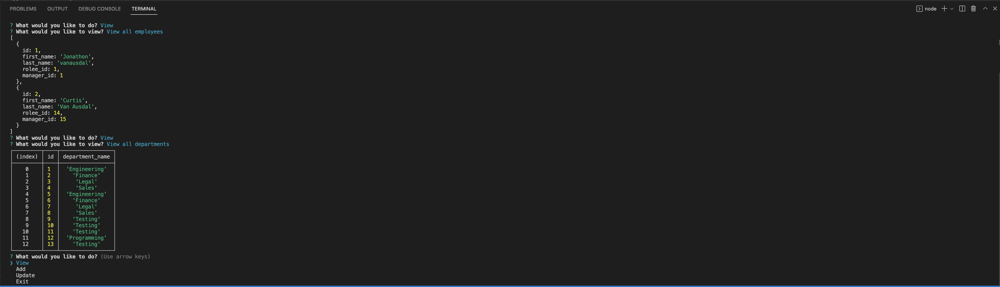

# # Title: Employee Tracker

## Discription:
* Employee Tracker uses inquier and sql to track your employee database. You can add to it and view all data.
- What was your motivation? - Way to access my employee database through inquirer.
- Why did you build this project? - Easy way to look through my sql database through prompted questions.
- What problem does it solve? - able to view and add to the employee database.
- What did you learn? - learned how to use db.query to work with inquirer to do different things to the employee database.

## Table of Contents (optional)
- [Installation](#installation)
- [Usage](#usage)
- [Credits](#credits)
- [License](#license)

## Installation:
- What are the steps to install your project?
* run npm start and answer all the inquirer questions based on your needs. 

## Usage:
Add a screenshot, create an `assets/images` folder in your repository and upload your screenshot to it. Then, using the relative filepath, add it to your README using the following syntax: !'[alt text](assets/images/screenshot.png)'
screenshot: 

## Credits:
* Collaborators: n/a
* Assets: n/a
* Tutorials: youtube.com
* Features: n/a
## Links:
* Github link: https://github.com/jonathonvanausdal9915/Employee-Trackerr
* 
* video link: https://drive.google.com/file/d/1PV7XfqAP_dV4-0kq7nU1YRb4zJXeVI6K/view?usp=sharing